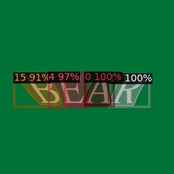
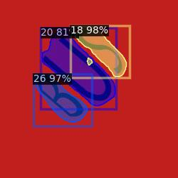
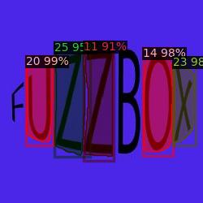

# Arbitrary Shape Text Detection

This repository implements an **arbitrary shape text detection** using **Detectron 2** for instance segmentation and **Mask-RCNN** as a backbone for extracting text features. 

---

## 📁 Dataset

- The dataset includes the images of arbitrary-shaped text with varied backgrounds.

- The data is annotated using `LabelMe` tool. Annotations are of bounding boxes with polygonal shapes, and labels are stored in `.json` format.

- The dataset can be downloaded using the [link]().

## 📊 Results

Example results of the trained model on test dataset.

  

## - Installation

```bash
1. Clone the repo:
   git clone <repo-url>
   cd <repo-name>

2. Install required libraries:
   `pip install requirements.txt`

3. Open text_detection.ipynb notebook and follow the installation instructions for the required libraries in it.
```

## - Inference

- If you want to carry out inference using my trained model available [here](), execute `detection_inference.py` in the `inference` folder using following command:

  `python inference/detection_inference.py \--config-file configs/ocr/config.yaml\--testdata test_images\--weights out_dir/trained_model/model_final.pth`

- Store the trained model weights in the `out_dir` folder and set the path in the above command.

- Similar command have to be used if you want to carry out inference using your own trained model weights.

## - Train a new model

### -Dataset

- All the data along with their annotated .json files should be stored in separate `train` and `test` folders located in `Maskdataset` folder.
  
- The dataset path should be set in `train_net.py`.

### - Training Parameters

- All the training parameters should be set in the `train_config.yml` file located in the `config` folder.

### - Pre-trained model weights

- Since the transfer learning technique is used in this project, I have used the pre-trained model weights trained in TextFuseNet ([github repo])(https://github.com/ying09/TextFuseNet.git).

- Download the pre-trained TextFuseNet model weights from [here]() and set the path in `train_config.yml` file.

### - Training

- After completing the above requirements, train your model by executing the following command:

  `python tools/train_net.py --num-gpus 1 --config-file configs/ocr/train_config.yaml`

- Your trained model weights will be stored in `./out_dir/trained_model/`.

#### All the training and inference commands are also present in the `text_detection.ipynb` notebook.
